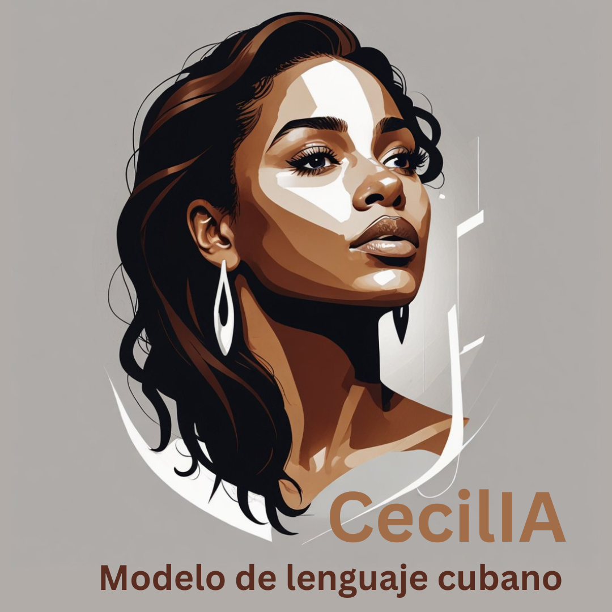

# Cecilia: The Cuban Language Model



Cecilia is a family of language models continual pretrained specifically on Cuban written text, capturing the linguistic, cultural, and social nuances of Cuban Spanish.
These models are designed to support natural language processing tasks with a focus on Cuban language varieties and cultural context.

## About Cecilia 2B v0.1

This repository contains **Cecilia 2B v0.1**, a 2 billion parameter model continual pretrained on Cuban written text from [Salamandra 2B](BSC-LT/salamandra-2b).

The model is developed by the [Artificial Intelligence Research Group (GIA-UH)](https://gia-uh.github.io/) at the [University of Havana](https://www.uh.cu/) with the collaboration
of [Language Processing and Information Systems Group (GPLSI)](https://gplsi.dlsi.ua.es/) at the [University of Alicante](https://www.ua.es/) and the support
of [Syalia SRL](https://syalia.com/) and [Epistemial](https://epistemial.com/).

- [Download to model weights from HuggingFace](https://huggingface.co/gia-uh/cecilia-2b-v0.1).
- [Read the Technical Report](report.pdf).

## Training Data

Cecilia Tiny was continual pretrained for 2 full epochs on a private corpus of approximately 600 million tokens of Cuban written text, including:

- 10 years of the most relevant Cuban newspapers.
- The Cuban Encyclopedia (ecured.cu).
- The complete collection of Cuban laws.
- Over 400 important Cuban literary works.
- Several local encyclopedias documenting Cubanisms and cultural elements.
- Hundreds of song lyrics from popular Cuban singers.

This diverse dataset ensures that Cecilia captures a rich spectrum of Cuban language, culture, and history.

## Model Architecture and Training

- Based on the Salamandra 2B architecture.
- Fine-tuned using continual pretraining and instruction tuning techniques.
- Optimized for Cuban Spanish linguistic features and cultural context.

## Use Cases

Cecilia can be used for various NLP tasks involving Cuban Spanish, such as:

- Text generation and completion.
- Sentiment analysis on Cuban social media or literature.
- Named entity recognition with Cuban-specific entities.
- Machine translation and language understanding tailored to Cuban Spanish.
- Research on Cuban linguistic phenomena and cultural studies.

## How to Use

You can easily load and use Cecilia Tiny (2B) v-0.1 with the Hugging Face Transformers library. Here is a simple example in Python:

```python
from transformers import AutoModelForCausalLM, AutoTokenizer

model_id = "gia-uh/cecilia-2b-v0.1"

# Load tokenizer and model
tokenizer = AutoTokenizer.from_pretrained(model_id)
model = AutoModelForCausalLM.from_pretrained(model_id)

# Example usage
input_text = "¿Cómo están las guaguas en La Habana?"
inputs = tokenizer(input_text, return_tensors="pt")
outputs = model.generate(**inputs, max_length=50)
print(tokenizer.decode(outputs[0], skip_special_tokens=True))
```

### Compatibility

- **vLLM:** Cecilia Tiny can be used with [vLLM](https://vllm.ai/) for efficient inference and serving.
- **LM Studio:** The model is compatible with [LM Studio](https://lmstudio.ai/), enabling easy local deployment and experimentation.

### Model Details

- The model is currently **not quantized**. Quantized versions will be released shortly to improve efficiency and reduce resource requirements.
- Cecilia Tiny is fine-tuned via **continual pretraining** on Cuban text but yet **is not instruction-tuned**. It is optimized for language modeling rather
  than instruction-following tasks. Instruction-tuned versions will be released soon.

## License and Usage

Cecilia Tiny (2B) v-0.1 is released under the **Creative Commons Attribution-ShareAlike 4.0 International (CC BY-SA 4.0)** license. This allows both research and commercial use, provided that appropriate credit is given and any derivative works are shared under the same license.

**Important:** Access to download the model requires a manual review of requests to ensure fair and responsible use aligned with the spirit of the license and the cultural sensitivity of the data. Please submit your request with a brief description of your intended use.

## Ethical Considerations

Cecilia is a powerful language model fine-tuned on Cuban written text, but it is important to recognize its limitations and use it responsibly:

- **Potential for Errors and Hallucinations:** Like all large language models, Cecilia can generate incorrect, misleading, or biased information. It may "hallucinate" facts or produce outputs that do not reflect reality or the nuances of Cuban culture perfectly.
- **Not a Substitute for Professional Advice:** Cecilia should **not** be used for medical, legal, financial, or other professional advice. Outputs should be carefully reviewed by qualified experts before any decision-making.
- **Bias and Fairness:** Despite efforts to curate training data, the model may still reflect biases present in source texts. Users should be aware of potential cultural, social, or linguistic biases and interpret results accordingly.
- **Privacy and Data Use:** The model was trained on publicly available and licensed Cuban texts. Users should respect privacy and copyright laws when applying the model.
- **Responsible Use:** We encourage users to apply Cecilia in ways that respect Cuban culture and society, avoid harm, and promote fairness and inclusivity.
- **Transparency:** Users should clearly communicate when content is generated by Cecilia to avoid confusion or misattribution.

By using Cecilia, you agree to apply it ethically and responsibly, understanding its limitations and the cultural sensitivity embedded in its design.

## Citation

If you use Cecilia in your research or projects, please cite:

> Cecilia Language Model, developed by the Artificial Intelligence Research Group (GIA-UH) at the University of Havana and the Group of Language Processing and Information Systems (GPLIS) at the University of Alicante.

## Team
The model could not have been created without the commitment and work of members of **GIA-UH** and **GPLSI** groups.

*GIA-UH* - Ernesto L. Estevanell, Daniel A. Valdés, Roberto Marti, Deborah Famadas, Roberto García, Gabriel Hernández,
Elena Rodríguez, Niley González, Alejandro Beltrán, Juan Pablo Consuegra, Suilan Estévez, Alejandro Piad, Yudivián Almeida.

*GPLSI* -  Robiert Sepúlveda, Yoan Gutiérrez, Rafael Muñoz, Andrés Montoyo, Manuel Palomar.

## Acknowledgments

We thank all contributors and data providers who made this work possible.

This work was partially funded by the [ILENIA](https://proyectoilenia.es/)-[VIVES](https://vives.gplsi.es/) project <<2022/TL22/00215334>>, and by private funding from [Syalia SRL](https://syalia.com) and [Epistemial](https://epistemial.com/).
