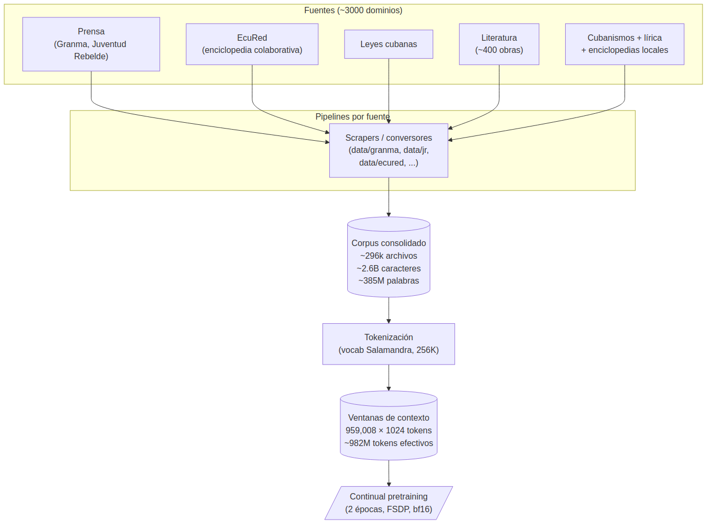

## 1. Resumen

**Cecilia**[^1] es una familia de modelos de lenguaje *continual-pretrained* en español cubano, desarrollada por el Grupo de Inteligencia Artificial de la Universidad de La Habana (GIA-UH), en colaboración con el Grupo de Procesamiento del Lenguaje y Sistemas de Información (GPLSI) de la Universidad de Alicante, y con apoyo de Syalia y Epistemial. La primera versión liberada, **Cecilia 2B v0.1**, adapta el modelo base **Salamandra 2B** mediante *continual pretraining* sobre aproximadamente mil millones de tokens de texto cubano: prensa, EcuRed, leyes, literatura y lírica. Sobre esa base se publicaron también una variante *instruction-tuned* (`cecilia-2b-instruct-v1`) y su correspondiente versión cuantizada en formato GGUF.

[^1]: El reporte técnico extendido en inglés se encuentra en `report/report.md`; el paper académico en formato LNCS, en `papers/uciencia25/paper.pdf`.

## 2. Arquitectura del modelo

Cecilia 2B se construye sobre **Salamandra 2B**, un *transformer* decoder-only desarrollado por el Barcelona Supercomputing Center, con 24 capas, *hidden size* 2048, 16 *attention heads*, y aproximadamente 2.25 mil millones de parámetros. La arquitectura incorpora *rotary positional embeddings* (RoPE), activaciones SwiGLU, normalización RMS y *flash attention*; el vocabulario es de 256K tokens y la ventana de contexto, de 8192 tokens.

La adaptación al español cubano se realiza **exclusivamente vía continual pretraining**: ni la arquitectura ni el tokenizador ni el vocabulario se modifican. Esta decisión preserva las capacidades multilingües del modelo base y evita introducir variabilidad no atribuible al corpus, pero implica que cubanismos y términos transliterados fuera del vocabulario de Salamandra reciben una tokenización subóptima — limitación reconocida y abordada en la sección 7.

La elección de Salamandra como base responde a tres criterios: foco multilingüe con énfasis explícito en español y co-oficiales, licencia Apache 2.0 que permite redistribución académica y comercial, y un tamaño compatible con despliegue en hardware modesto, condición relevante para los entornos de cómputo típicos en Cuba.

## 3. Corpus y pipeline de datos

El corpus de entrenamiento agrupa **296,311 archivos**, **~2,631 millones de caracteres** y **~385 millones de palabras**, distribuidos en aproximadamente 3000 dominios. Las fuentes principales son: la prensa cubana de la última década (Granma, Juventud Rebelde — pipelines en `data/granma/`, `data/jr/`); la enciclopedia colaborativa **EcuRed** (`data/ecured/`), dominante en número de archivos; una compilación de **leyes cubanas**; alrededor de 400 obras literarias cubanas; enciclopedias locales documentando cubanismos; y letras de canciones populares. Toda la recolección se hizo bajo asunción de *fair use* estrictamente para investigación académica; el corpus crudo no se redistribuye.

Tras tokenización con el *tokenizer* original de Salamandra, el corpus se materializa en **1,104,532 muestras** y **982,024,795 tokens efectivos** (sin *padding*) — 1,131,040,768 con *padding*, ratio de *padding* del 13.2%. La longitud media de secuencia es de 889 tokens y la segmentación final produjo **959,008 ventanas de contexto** de 1024 tokens. La densidad léxica de 6.8 caracteres por palabra y la longitud media de documento de ~8,900 caracteres reflejan una mezcla balanceada entre textos breves (entradas enciclopédicas cortas, lírica) y narrativos largos (literatura, leyes).

{#fig-pipeline-datos width=80%}

## 4. Procedimiento de continual pretraining

El entrenamiento se ejecutó por **dos épocas completas** sobre el corpus tokenizado, con *batch size* de 4 y *gradient accumulation* de 16 pasos, equivalente a un *batch* efectivo de 64. La optimización usó **AdamW** con *learning rate* 2e-5, *weight decay* 0.01, betas (0.9, 0.999), y *gradient clipping* a norma 1.0. El *scheduler* siguió un esquema *warmup-linear* con 6% de *warmup* — fracción deliberadamente pequeña, ya que en *continual pretraining* el modelo parte de un estado convergente y no requiere el *warmup* extendido típico del entrenamiento desde cero.

La precisión empleada fue **bfloat16** mixta, con paralelización **FSDP** (*full sharding* y *sharded state dicts*) y *gradient checkpointing* activado para reducir el *footprint* de memoria a costa de cómputo adicional en el *backward pass*. La validación se ejecutó tras cada época y, adicionalmente, cada 640 pasos de entrenamiento, para detectar tempranamente regresiones o inestabilidad.

El cómputo se realizó sobre **2 × NVIDIA A100 (40 GB)** acompañadas por un AMD EPYC con 128 *cores* y 1 TB de RAM. La duración total del entrenamiento fue de aproximadamente **48 horas**.

| Parámetro | Valor |
|---|---|
| Épocas | 2 |
| Batch size | 4 |
| Gradient accumulation | 16 |
| Batch efectivo | 64 |
| Optimizador | AdamW |
| Learning rate | 2e-5 |
| Weight decay | 0.01 |
| Warmup proportion | 6% |
| Precisión | bfloat16 |
| Paralelización | FSDP (full sharding) |

## 5. Evaluación y trade-offs

La evaluación comparativa contra el modelo base Salamandra 2B se ejecutó sobre una batería estándar de *benchmarks* generales en inglés y español: ARC, BELEBELE, OpenBookQA, PAWS, PIQA, SocialIQA, XNLI, XStoryCloze, XQuAD, TriviaQA, XLSum, Cocoteros, ESCOLA, TECA y WNLI. La diferencia agregada relativa al base es de **−2.4%** en promedio sobre todas las tareas. La tabla siguiente resume las principales mejoras y regresiones; los detalles completos viven en `report/report.md`.

| Tarea | Métrica | Salamandra | Cecilia | Δ rel |
|---|---|---:|---:|---:|
| `belebele_en` | acc | 0.216 | 0.248 | **+13.0%** |
| `belebele_es` | acc | 0.228 | 0.244 | **+6.8%** |
| `wnli_es` | acc | 0.563 | 0.592 | **+4.8%** |
| `arc_challenge` | acc | 0.370 | 0.382 | **+3.1%** |
| `xlsum_es` | rouge1 | 0.135 | 0.087 | **−35.4%** |
| `xlsum_es` | bleu | 0.801 | 0.597 | **−25.4%** |
| `cocoteros_es` | bleu | 8.465 | 6.723 | **−20.6%** |
| **Media** | | | | **−2.4%** |

**Lectura.** Cecilia mejora consistentemente en tareas de comprensión multilingüe (BELEBELE, XNLI, PAWS) y razonamiento (ARC), donde la exposición ampliada a texto en español resulta beneficiosa. Las regresiones se concentran en *summarization* y *translation* (XLSum, Cocoteros), tareas particularmente sensibles al *catastrophic forgetting* del *fine-tuning* continual y donde el corpus cubano —predominantemente expositivo y enciclopédico— probablemente desplaza estilos generativos del modelo base.

**Caveat fundamental.** Estos *benchmarks* son generales y **no miden** lo que Cecilia se propone resolver: el manejo competente de fenómenos lingüísticos cubanos (cubanismos, NER local, comprensión cultural, registros propios). Una evaluación específicamente cubana es trabajo pendiente y prioritario para el siguiente *release*.

## 6. Artefactos publicados y aplicaciones

- **`gia-uh/cecilia-2b-v0.1`** — modelo base *continual-pretrained*, publicado en HuggingFace (DOI [10.57967/hf/5667](https://doi.org/10.57967/hf/5667)) el 29 de mayo de 2025. Acceso *gated* con revisión manual de solicitudes, alineada con la naturaleza de los datos de entrenamiento.
- **`gia-uh/cecilia-2b-instruct-v1`** — variante *instruction-tuned* sobre la base, liberada el 29 de noviembre de 2025. Habilita uso conversacional y *task-following* en español cubano y general.
- **`gia-uh/cecilia-2b-instruct-v1-GGUF`** — versión cuantizada en formato GGUF para inferencia eficiente en CPU y hardware modesto (compatible con LM Studio, llama.cpp, Ollama).
- **Repositorio `gia-uh/cecilia`** — incluye apps Streamlit (`apps/`) para *chat*, *training feedback* y consulta del reporte; *pipelines* de procesamiento por fuente (`data/`); el reporte técnico extendido (`report/report.md`); papers (`papers/uciencia25/`, `papers/cm25/`); y un *bot* de Telegram (`telegram-bot/`) que sirve como *frontend* público de prueba.
- **Sitio del proyecto** — [cecilia.uhgia.org](https://cecilia.uhgia.org), generado desde `docs/`.
- **Inferencia.** El modelo base no cuantizado requiere aproximadamente **14 GB de VRAM**; las variantes GGUF reducen drásticamente ese requerimiento. Compatible con vLLM, *transformers* y LM Studio.

## 7. Limitaciones y siguientes pasos

**Limitaciones reconocidas.** El *tokenizer* heredado de Salamandra fragmenta sub-óptimamente cubanismos y términos transliterados, costando capacidad representacional sobre exactamente el vocabulario que más interesa al proyecto. La evaluación específicamente cubana —cubanismos, *NER* local, comprensión cultural— no existe aún; los *benchmarks* generales reportados son sólo un *proxy* débil. Las regresiones observadas en *summarization* y *translation* indican un trade-off real del *continual pretraining* que un eventual reentrenamiento del *tokenizer* o un balance más cuidado del *mix* de datos podría mitigar.

**Direcciones inmediatas.** Las prioridades del *roadmap* son: (a) construir una **batería de evaluación específicamente cubana** que mida lo que el modelo se propone resolver; (b) **reentrenar el *tokenizer*** para capturar cubanismos como *tokens* íntegros; (c) explorar **tamaños mayores** (Salamandra 7B u otros bases) una vez consolidada la metodología sobre el 2B; y (d) **ampliar y curar el corpus**, incorporando registros más informales y fuentes orales transcritas que la composición actual subrepresenta.
